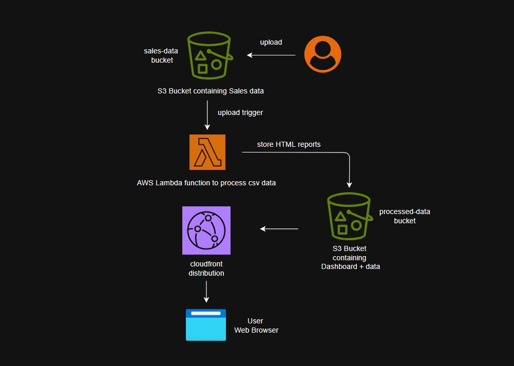

# CSV Processor for Video Game Sales Data Analytics

   

A cloud-based serverless solution that processes CSV data containing video game sales information, generates analytics, and visualizes the results in a real-time dashboard.

## 🚀 Cloudfront deployment link
[Dashboard Link](https://d2l9hoyveodwc5.cloudfront.net/dashboard/index.html)

## 📊 Overview

This project demonstrates a complete serverless data processing pipeline using AWS services to analyze video game sales data. When a CSV file is uploaded to an S3 bucket, it automatically triggers an AWS Lambda function that:

1. Processes the CSV data
2. Extracts key insights like total sales, top genres, and popular platforms
3. Generates individual HTML reports for each file
4. Updates a dashboard with the latest analytics

## 🏗️ Architecture



- **AWS Lambda**: Handles the serverless processing logic
- **Amazon S3**: Stores input CSV files, processed results, and web assets
- **Amazon CloudFront**: Secures and distributes the dashboard
- **AWS IAM**: Manages secure access between services

## 🔧 Setup & Deployment

### Prerequisites

- Grab sales data from [Kaggle](https://www.kaggle.com/datasets/gregorut/videogamesales)
- AWS account with appropriate permissions
- Python 3.8 or higher
- AWS CLI configured locally

### Deployment Steps

1. **Create S3 Buckets**:
   ```bash
   aws s3 mb s3://your-input-bucket-name
   aws s3 mb s3://your-output-bucket-name
   ```

2. **Deploy Lambda Function**:
   ```bash
   # Create a deployment package
   zip -r function.zip lambda_function.py

   # Create the Lambda function
   aws lambda create-function \
     --function-name csv-processor \
     --runtime python3.8 \
     --handler lambda_function.lambda_handler \
     --role arn:aws:iam::<YOUR_ACCOUNT_ID>:role/lambda-csv-processor-role \
     --zip-file fileb://function.zip
   ```

3. **Set Up S3 Trigger**:
   ```bash
   aws lambda add-permission \
     --function-name csv-processor \
     --statement-id s3-trigger \
     --action lambda:InvokeFunction \
     --principal s3.amazonaws.com \
     --source-arn arn:aws:s3:::your-input-bucket-name
   ```

4. **Upload Dashboard Assets**:
   ```bash
   aws s3 cp dashboard/index.html s3://your-output-bucket-name/dashboard/index.html
   aws s3 cp dashboard-data.json s3://your-output-bucket-name/dashboard-data.json
   ```

5. **Set Up CloudFront (Optional for Enhanced Security)**:
   Follow the steps in the AWS console to create a CloudFront distribution pointing to your S3 bucket.

## 🚀 Usage

1. **Upload a CSV file** to the input S3 bucket:
   ```bash
   aws s3 cp vgsales.csv s3://your-input-bucket-name/
   ```

2. **Lambda processes the file** automatically (no action required)

3. **View the dashboard** at:
   ```
   https://[your-cloudfront-domain]/
   ```
   Or directly from S3:
   ```
   http://your-output-bucket-name.s3-website-[region].amazonaws.com/
   ```

## 📋 CSV Format

The system expects CSV files with the following columns:
```
Rank, Name, Platform, Year, Genre, Publisher, NA_Sales, EU_Sales, JP_Sales, Other_Sales, Global_Sales
```

Example:
```csv
Rank,Name,Platform,Year,Genre,Publisher,NA_Sales,EU_Sales,JP_Sales,Other_Sales,Global_Sales
1,Wii Sports,Wii,2006,Sports,Nintendo,41.49,29.02,3.77,8.46,82.74
```

## 📊 Dashboard Features

- Summary of processed data
- Top game genres visualization
- Platform popularity analysis
- Sales trends and metrics
- Historical report access

## 🔒 Security Considerations

- S3 bucket access is restricted
- CloudFront distribution uses HTTPS
- IAM roles follow principle of least privilege
- No sensitive data is exposed in the dashboard

## 📝 Contributing

1. Fork the repository
2. Create a feature branch: `git checkout -b feature/amazing-feature`
3. Commit changes: `git commit -m 'Add amazing feature'`
4. Push to the branch: `git push origin feature/amazing-feature`
5. Open a Pull Request

---

**Note**: This project is designed for demonstration purposes. For production environments, consider implementing additional security measures and error handling.